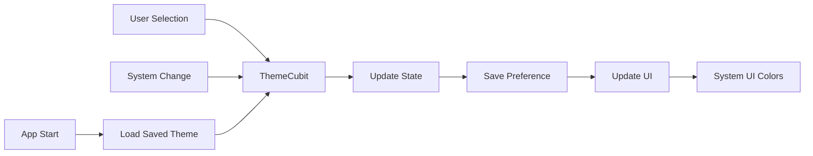

# QuickBite Settings & Dark Theme Complete Guide

## 📖 Table of Contents
1. [Overview](#overview)
2. [Settings Screen Features](#settings-screen-features)
3. [Dark Theme Implementation](#dark-theme-implementation)
4. [Theme Management System](#theme-management-system)
5. [User Interface Adaptation](#user-interface-adaptation)
6. [Technical Architecture](#technical-architecture)
7. [File Structure](#file-structure)
8. [Usage Guide](#usage-guide)
9. [Customization Options](#customization-options)
10. [Troubleshooting](#troubleshooting)

---

## 🎯 Overview

QuickBite features a comprehensive settings system with a fully functional dark theme implementation. The app provides users with complete control over their visual experience while maintaining brand consistency and accessibility standards.

### Key Features
- ✅ **Full Dark Theme Support** - Professional dark mode with proper contrast
- ✅ **System Theme Integration** - Follows device theme settings automatically
- ✅ **Theme Persistence** - Remembers user preferences across app restarts
- ✅ **Language Selection** - English/Arabic support with RTL compatibility
- ✅ **Notification Management** - Granular notification controls
- ✅ **Clean UI Design** - Modern, intuitive settings interface

---

## ⚙️ Settings Screen Features

### 📱 **Screen Layout**

The settings screen is organized into logical sections for better user experience:

```
┌─────────────────────────────────┐
│ Settings                    [←] │
├─────────────────────────────────┤
│ 👤 Account                      │
│ • Notifications          [🔔 ⚪] │
├─────────────────────────────────┤
│ 🎨 Appearance                   │
│ • Language              EN [>]  │
│ • Theme               Light [>] │
├─────────────────────────────────┤
│ ℹ️  About                        │
│ • App Version         1.0.0 [>] │
│ • Help & Support            [>] │
│ • Privacy Policy            [>] │
└─────────────────────────────────┘
```

### 🔧 **Feature Details**

#### **Account Section**
| Feature | Description | Status |
|---------|-------------|---------|
| **Notifications** | Push notification toggle | ⚠️ UI Ready (Backend pending) |

#### **Appearance Section**
| Feature | Description | Status |
|---------|-------------|---------|
| **Language** | English/Arabic selection | ✅ Fully Functional |
| **Theme** | Light/Dark/System selection | ✅ Fully Functional |

#### **About Section**
| Feature | Description | Status |
|---------|-------------|---------|
| **App Version** | Displays current version | ✅ Functional |
| **Help & Support** | Support contact (placeholder) | ⚠️ Placeholder |
| **Privacy Policy** | Privacy information (placeholder) | ⚠️ Placeholder |

---

## 🌙 Dark Theme Implementation

### 🎨 **Visual Design**

#### **Light Theme Colors**
```scss
Primary: #FF6B00 (Orange)
Background: #f8f1df (Cream)
Surface: #FFFFFF (White)
Text: #2E2E2E (Dark Gray)
```

#### **Dark Theme Colors**
```scss
Primary: #FF6B00 (Same Orange)
Background: #121212 (Dark Gray)
Surface: #1E1E1E (Darker Gray)
Text: #E0E0E0 (Light Gray)
```

### 🔄 **Theme Modes**

| Mode | Description | Behavior |
|------|-------------|----------|
| **Light** | Always uses light theme | Fixed light appearance |
| **Dark** | Always uses dark theme | Fixed dark appearance |
| **System** | Follows device settings | Auto-switches with system |

### 📊 **Theme Selection Dialog**

When users tap "Theme" in settings, they see:

```
┌─────────────────────────────────┐
│ Select Theme                    │
├─────────────────────────────────┤
│ ☀️  Light                       │
│    Always use light theme       │
│                            [✓]  │
├─────────────────────────────────┤
│ 🌙 Dark                         │
│    Always use dark theme        │
│                                 │
├─────────────────────────────────┤
│ ⚙️  System                      │
│    Follow system settings       │
│                                 │
├─────────────────────────────────┤
│              [Cancel]           │
└─────────────────────────────────┘
```

---

## 🔧 Theme Management System

### 📁 **Core Components**

#### **1. ThemeState (theme_state.dart)**
```dart
enum AppThemeMode { light, dark, system }

class ThemeState {
  final AppThemeMode themeMode;
  final bool isDarkMode;
  final bool isSystemMode;
  
  // Helper methods
  ThemeMode get flutterThemeMode;
  String get themeDescription;
  IconData get themeIcon;
}
```

#### **2. ThemeCubit (theme_cubit.dart)**
```dart
class ThemeCubit extends Cubit<ThemeState> {
  // Theme management methods
  Future<void> setLightTheme();
  Future<void> setDarkTheme();
  Future<void> setSystemTheme();
  Future<void> toggleTheme();
  void onSystemBrightnessChanged();
}
```

#### **3. AppTheme (app_theme.dart)**
```dart
class AppTheme {
  static ThemeData get lightTheme;  // Complete light theme
  static ThemeData get darkTheme;   // Complete dark theme
  
  // Helper methods
  static bool isDarkMode(BuildContext context);
  static Color getPrimaryColor(BuildContext context);
}
```

### 🔄 **Theme Flow**



---

## 🎨 User Interface Adaptation

### 📱 **Screen Headers**

All main screens have theme-aware headers:

#### **Before (Hardcoded)**
```dart
//backgroundColor: const Color(0xFFf8f1df),  // Always cream
//foregroundColor: AppTheme.accentColor,     // Always dark
```

#### **After (Theme-Aware)**
```dart
//backgroundColor: theme.scaffoldBackgroundColor,  // Dynamic
//iconTheme: IconThemeData(color: theme.colorScheme.onSurface),
//titleTextStyle: theme.textTheme.titleLarge?.copyWith(
//color: theme.colorScheme.onSurface,
//fontWeight: FontWeight.bold,
//),
```

### 🖼️ **Screen Adaptations**

| Screen | Light Mode | Dark Mode |
|--------|------------|-----------|
| **Profile** | Cream header, dark text | Dark header, light text |
| **Cart** | White cards, orange accent | Dark cards, orange accent |
| **Orders** | Light status badges | Dark status badges |
| **Settings** | Cream background | Dark background |

### 🎯 **Component Theming**

#### **Cards & Containers**
```dart
// Theme-aware card styling
//Container(
  //color: theme.colorScheme.surface,  // Auto light/dark
  //child: Text(
    //'Content',
    //style: TextStyle(color: theme.colorScheme.onSurface),
  //),
//)
```

#### **Buttons & Icons**
```dart
// Theme-aware button styling
//ElevatedButton(
  //style: ElevatedButton.styleFrom(
   // backgroundColor: theme.colorScheme.primary,  // Always orange
    //foregroundColor: theme.brightness == Brightness.dark 
      //? Colors.black   // Black text on orange in dark mode
      //: Colors.white,  // White text on orange in light mode
  //),
//)
```

---

## 🏗️ Technical Architecture

### 📂 **File Structure**

```
lib/
├── presentation/
│   ├── view_models/
│   │   ├── cubit/
│   │   │   ├── theme_cubit.dart          # Theme management logic
│   │   │   ├── language_cubit.dart       # Language management
│   │   │   └── notification_cubit.dart   # Notification preferences
│   │   └── stats/
│   │       ├── theme_state.dart          # Theme state definitions
│   │       ├── language_state.dart       # Language state
│   │       └── notification_state.dart   # Notification state
│   ├── screens/
│   │   ├── settings/
│   │   │   └── settings_screen.dart      # Main settings interface
│   │   ├── profile_screen.dart           # Enhanced profile with theme
│   │   ├── cart/cart_screen.dart         # Theme-aware cart
│   │   └── orders/orders_screen.dart     # Theme-aware orders
│   └── widgets/
│       └── [various theme-aware widgets]
├── core/
│   └── theme/
│       └── app_theme.dart                # Theme definitions
└── main.dart                             # App setup with theme
```

### 🔌 **Integration Points**

#### **1. Main App Setup**
```dart
//MultiBlocProvider(
  //providers: [
    //BlocProvider<ThemeCubit>(
      //create: (context) => ThemeCubit(prefs),
    //),
    // Other providers...
  //],
  //child: BlocBuilder<ThemeCubit, ThemeState>(
    //builder: (context, themeState) {
      //return MaterialApp(
        //theme: AppTheme.lightTheme,
        //darkTheme: AppTheme.darkTheme,
        //themeMode: themeState.flutterThemeMode,  // Dynamic theme mode
      //);
    //},
  //),
//)
```

#### **2. Settings Integration**
```dart
// Theme selection in settings
//BlocBuilder<ThemeCubit, ThemeState>(
  //builder: (context, themeState) {
    //return ListTile(
      //title: Text('Theme'),
      //subtitle: Text('Current: ${themeState.themeDescription}'),
      //onTap: () => _showThemeDialog(context),
    //);
  //},
//)
```

#### **3. Widget Theme Usage**
```dart
// Using theme in widgets
Widget build(BuildContext context) {
  final theme = Theme.of(context);
  return Container(
    color: theme.scaffoldBackgroundColor,
    child: Text(
      'Hello',
      style: TextStyle(color: theme.colorScheme.onSurface),
    ),
  );
}
```

---

## 📖 Usage Guide

### 👤 **For Users**

#### **Changing Theme**
1. Open QuickBite app
2. Navigate to **Settings** (bottom navigation)
3. Tap **"Theme"** under Appearance section
4. Select preferred option:
    - **Light**: Always bright theme
    - **Dark**: Always dark theme
    - **System**: Follow phone settings
5. Theme changes immediately

#### **Changing Language**
1. In Settings, tap **"Language"**
2. Select **English** or **العربية (Arabic)**
3. App interface updates instantly

#### **Managing Notifications**
1. In Settings, toggle **"Notifications"**
2. Currently shows placeholder (feature in development)

### 👨‍💻 **For Developers**

#### **Adding New Theme-Aware Widgets**
```dart
class MyWidget extends StatelessWidget {
  @override
  Widget build(BuildContext context) {
    final theme = Theme.of(context);
    final isDark = theme.brightness == Brightness.dark;
    
    return Container(
      // ✅ DO: Use theme colors
      color: theme.colorScheme.surface,
      
      // ❌ DON'T: Use hardcoded colors
      // color: Colors.white,
      
      child: Text(
        'Text',
        style: TextStyle(
          color: theme.colorScheme.onSurface,  // Auto light/dark
        ),
      ),
    );
  }
}
```

#### **Accessing Theme State**
```dart
// Get current theme mode
final themeCubit = context.read<ThemeCubit>();
final isDarkMode = themeCubit.isDarkMode;
final themeMode = themeCubit.state.themeMode;

// Change theme programmatically
//context.read<ThemeCubit>().setDarkTheme();
//context.read<ThemeCubit>().setSystemTheme();
```

---

## 🎨 Customization Options

### 🌈 **Color Customization**

To modify theme colors, edit `AppTheme` class:

```dart
class AppTheme {
  // Light Theme Colors
  static const Color primaryColor = Color(0xFFFF6B00);     // Orange
  static const Color backgroundColor = Color(0xFFf8f1df);  // Cream
  static const Color surfaceColor = Color(0xFFFFFFFF);     // White
  
  // Dark Theme Colors
  static const Color darkPrimaryColor = Color(0xFFFF6B00); // Same orange
  static const Color darkBackgroundColor = Color(0xFF121212);
  static const Color darkSurfaceColor = Color(0xFF1E1E1E);
}
```

### 🔧 **Adding New Settings**

1. **Add to UI** (settings_screen.dart):
```dart
//ListTile(
  //leading: Icon(Icons.new_feature),
  //title: Text('New Setting'),
  //trailing: Switch(
    //value: settingValue,
    //onChanged: (value) => updateSetting(value),
  //),
//)
```

2. **Add State Management**:
```dart
// Create new cubit if needed
class NewSettingCubit extends Cubit<NewSettingState> {
  // Implementation
}
```

3. **Add to Providers**:
```dart
//BlocProvider<NewSettingCubit>(
  //create: (context) => NewSettingCubit(),
//)
```

---

## 🔍 Troubleshooting

### ❓ **Common Issues**

#### **Theme Not Changing**
**Problem**: Theme doesn't switch when selected
**Solutions**:
- Check if `ThemeCubit` is properly provided in `main.dart`
- Verify `SharedPreferences` permissions
- Ensure `BlocBuilder<ThemeCubit>` wraps `MaterialApp`

#### **System Theme Not Working**
**Problem**: System theme mode doesn't follow device settings
**Solutions**:
- Check `SystemThemeListener` widget is properly implemented
- Verify `onSystemBrightnessChanged()` is called
- Test on physical device (emulator may not reflect system changes)

#### **Colors Not Updating**
**Problem**: Some widgets don't change color with theme
**Solutions**:
- Replace hardcoded colors with `theme.colorScheme.*`
- Use `Theme.of(context)` instead of static colors
- Rebuild widgets with `BlocBuilder` if needed

#### **Settings Not Persisting**
**Problem**: Settings reset when app restarts
**Solutions**:
- Check `SharedPreferences` initialization in `main.dart`
- Verify write permissions
- Check if `await` is used in save operations

### 🛠️ **Debug Information**

#### **Theme State Debugging**
```dart
// Add to debug current theme state
final themeCubit = context.read<ThemeCubit>();
//print('Theme Mode: ${themeCubit.state.themeMode}');
//print('Is Dark: ${themeCubit.state.isDarkMode}');
//print('Is System: ${themeCubit.state.isSystemMode}');
```

#### **Testing Theme Changes**
```dart
// Programmatically test theme changes
void testThemeChanges() {
  final themeCubit = context.read<ThemeCubit>();
  
  // Test light theme
  themeCubit.setLightTheme();
  
  // Wait and test dark theme
  Future.delayed(Duration(seconds: 2), () {
    themeCubit.setDarkTheme();
  });
  
  // Test system theme
  Future.delayed(Duration(seconds: 4), () {
    themeCubit.setSystemTheme();
  });
}
```

---

## 📊 Performance Considerations

### ⚡ **Optimization Tips**

1. **Efficient Theme Loading**:
    - Theme is loaded once at app startup
    - Changes are cached in memory
    - Only UI updates when theme changes

2. **Minimal Rebuilds**:
    - Use `BlocBuilder` only where theme affects UI
    - Static widgets don't rebuild unnecessarily
    - Theme changes are batched for performance

3. **Memory Usage**:
    - Theme data is shared across widgets
    - No duplicate theme objects created
    - Efficient color calculation

---

## 🚀 Future Enhancements

### 🔮 **Planned Features**

1. **Custom Theme Colors**:
    - Allow users to pick custom primary colors
    - Save color preferences
    - Real-time color preview

2. **Advanced Notifications**:
    - Granular notification categories
    - Time-based notification settings
    - Push notification management

3. **Accessibility**:
    - High contrast themes
    - Font size controls
    - Color blind friendly options

4. **Theme Animations**:
    - Smooth theme transition animations
    - Custom transition effects
    - Animated color changes

---

## 📝 Conclusion

QuickBite's settings and dark theme system provides a comprehensive, user-friendly way to customize the app experience. The implementation follows Flutter best practices, maintains performance, and offers extensive customization options while keeping the codebase clean and maintainable.

### ✅ **Key Benefits**

- **User Experience**: Intuitive settings with immediate visual feedback
- **Accessibility**: Proper contrast and readability in both themes
- **Performance**: Efficient theme management with minimal overhead
- **Maintainability**: Clean architecture with separated concerns
- **Extensibility**: Easy to add new settings and themes

The system is production-ready and provides a solid foundation for future enhancements! 🎉