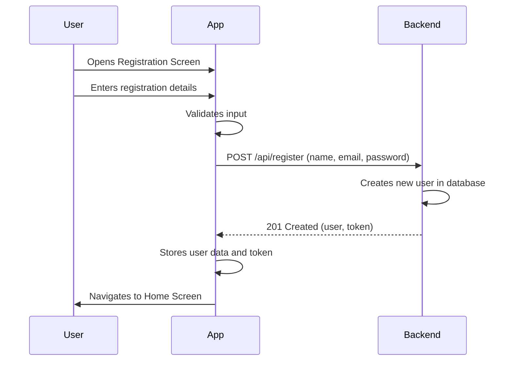
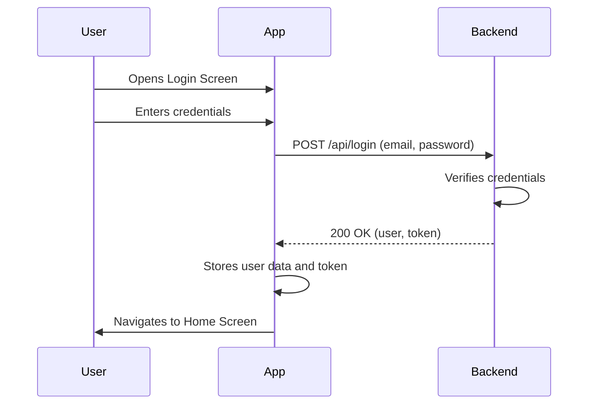
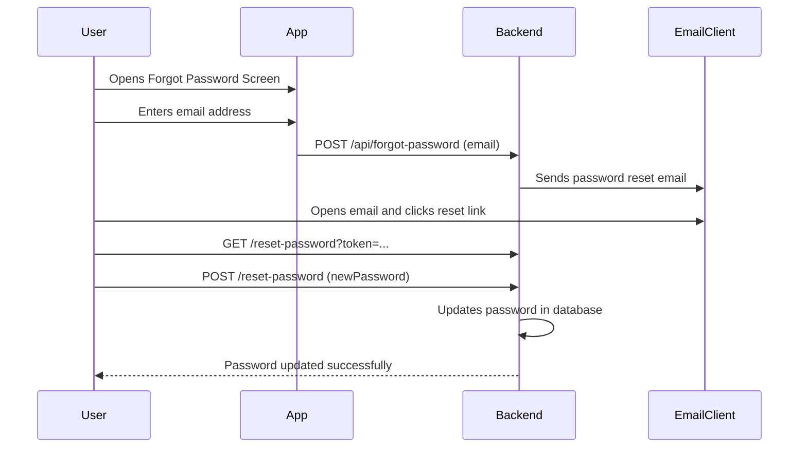

# Authentication Workflow

This document describes the authentication workflow in the QuickBite application, which includes user registration, login, and password reset.

## 1. User Registration

The registration process allows a new user to create an account.

### Steps

1.  The user navigates to the registration screen.
2.  The user enters their name, email address, and password.
3.  The user submits the registration form.
4.  The application validates the input.
5.  The application sends a request to the backend to create a new user account.
6.  The backend creates the new user and returns a success response.
7.  The user is automatically logged in and redirected to the home screen.

### Visualization

## 2. User Login

The login process allows an existing user to access their account.

### Steps

1.  The user navigates to the login screen.
2.  The user enters their email address and password.
3.  The user submits the login form.
4.  The application sends a request to the backend to authenticate the user.
5.  The backend verifies the credentials.
6.  The backend returns a success response with a new token.
7.  The user is logged in and redirected to the home screen.

### Visualization

## 3. Password Reset

The password reset process allows a user to reset their password if they have forgotten it.

### Steps

1.  The user navigates to the "Forgot Password" screen.
2.  The user enters their email address.
3.  The application sends a request to the backend to initiate the password reset process.
4.  The backend sends a password reset link to the user's email address.
5.  The user clicks the link in the email, which opens a password reset page in the browser.
6.  The user enters a new password and confirms it.
7.  The backend updates the user's password.

### Visualization

