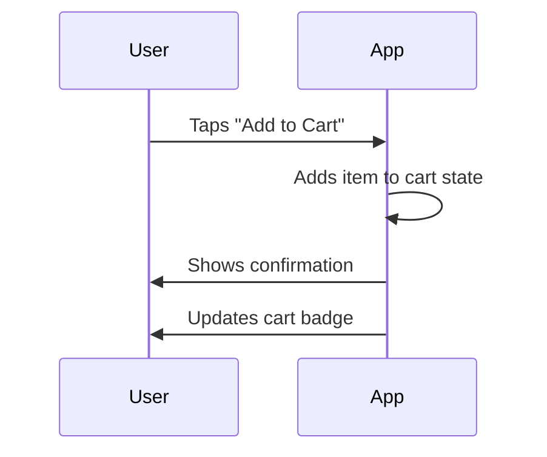
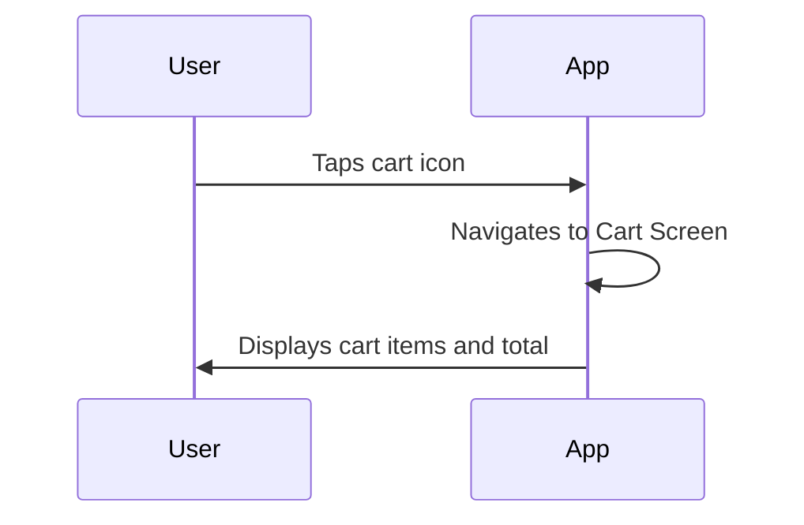
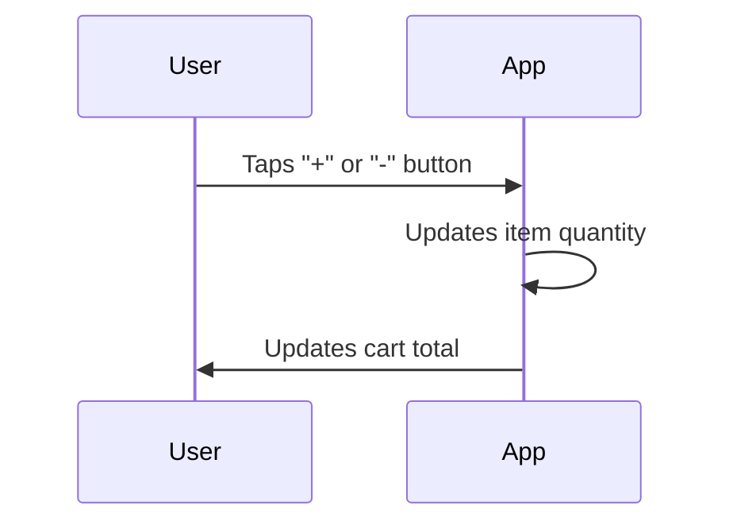
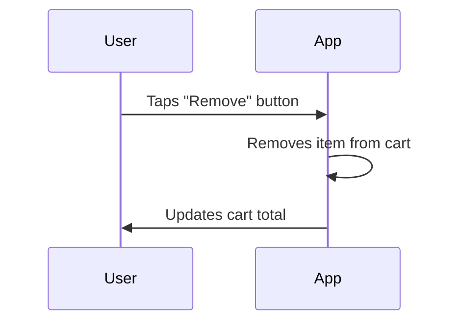

# Cart Management Workflow

This document describes the cart management workflow in the QuickBite application, which allows users to add, update, and remove items from their shopping cart.

## 1. Add Item to Cart

Users can add items to their cart from the food item details screen.

### Steps

1.  The user is on the food item details screen.
2.  The user taps the "Add to Cart" button.
3.  The application adds the item to the cart.
4.  The application displays a confirmation message to the user.
5.  The cart icon in the header updates to show the number of items in the cart.

### Visualization

## 2. View Cart

Users can view the contents of their cart by tapping the cart icon.

### Steps

1.  The user taps the cart icon in the header.
2.  The application navigates to the cart screen.
3.  The cart screen displays a list of all items in the cart, along with the quantity and price of each item.
4.  The cart screen also displays the total price of the order.

### Visualization

## 3. Update Item Quantity

Users can update the quantity of an item in their cart.

### Steps

1.  The user is on the cart screen.
2.  The user taps the "+" or "-" button next to an item to increase or decrease the quantity.
3.  The application updates the item's quantity and the total price of the order.

### Visualization

## 4. Remove Item from Cart

Users can remove an item from their cart.

### Steps

1.  The user is on the cart screen.
2.  The user taps the "Remove" button next to an item.
3.  The application removes the item from the cart and updates the total price of the order.

### Visualization

