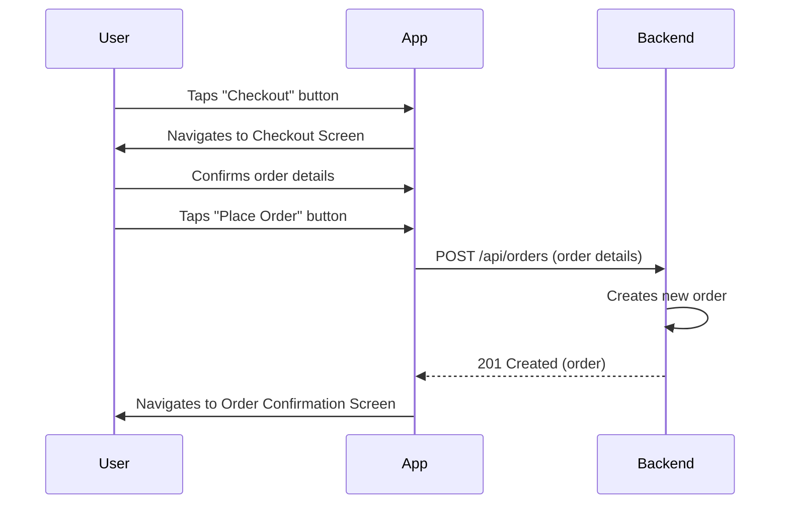
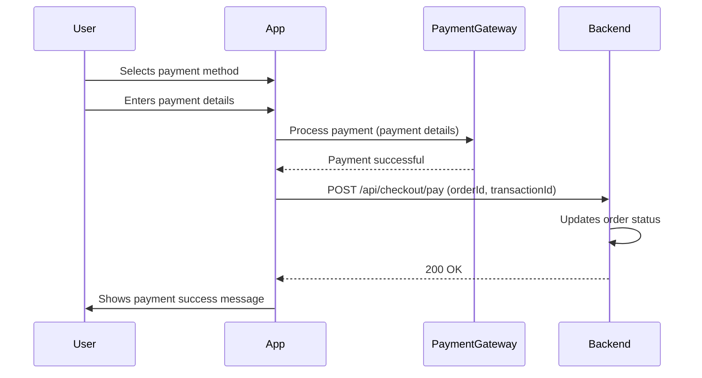

# Checkout Workflow

This document describes the checkout workflow in the QuickBite application, which allows users to place an order and make a payment.

## 1. Place Order

After reviewing their cart, users can proceed to checkout.

### Steps

1.  The user is on the cart screen.
2.  The user taps the "Checkout" button.
3.  The application navigates to the checkout screen.
4.  The checkout screen displays the user's delivery address and payment information.
5.  The user can confirm the order details and tap the "Place Order" button.
6.  The application sends a request to the backend to create a new order.
7.  The backend creates the order and returns a success response.

### Visualization

## 2. Make Payment

After placing an order, the user needs to make a payment.

### Steps

1.  The user is on the order confirmation screen.
2.  The user selects a payment method.
3.  The user enters their payment details.
4.  The application sends a request to the payment gateway to process the payment.
5.  The payment gateway processes the payment and returns a response to the application.
6.  The application updates the order status to "paid".

### Visualization

