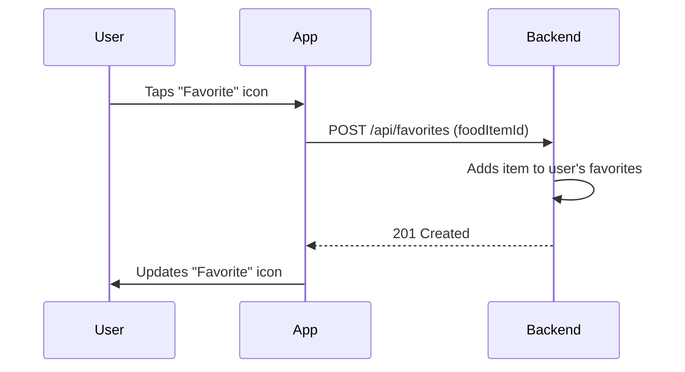
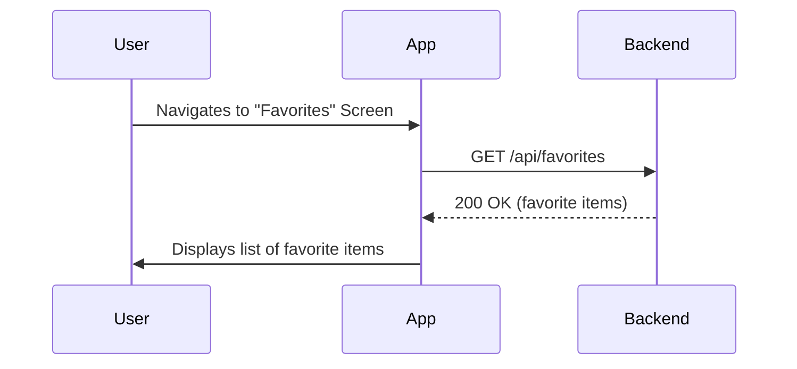
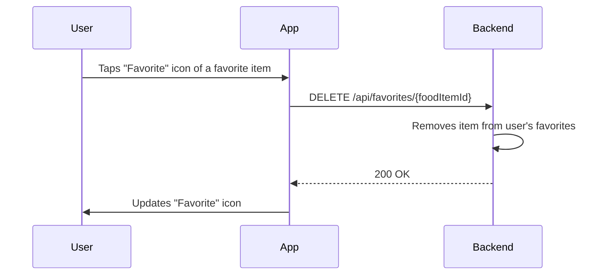

# Favorites Management Workflow

This document describes the favorites management workflow in the QuickBite application, which allows users to manage their favorite food items.

## 1. Add to Favorites

Users can add a food item to their list of favorites.

### Steps

1.  The user is on the food item details screen.
2.  The user taps the "Favorite" icon.
3.  The application sends a request to the backend to add the item to the user's favorites.
4.  The backend adds the item to the user's favorites and returns a success response.
5.  The "Favorite" icon updates to indicate that the item is a favorite.

### Visualization

## 2. View Favorites

Users can view their list of favorite food items.

### Steps

1.  The user navigates to the "Favorites" screen.
2.  The application fetches the user's list of favorite food items from the backend.
3.  The application displays the list of favorite food items.

### Visualization

## 3. Remove from Favorites

Users can remove a food item from their list of favorites.

### Steps

1.  The user is on the "Favorites" screen or the food item details screen.
2.  The user taps the "Favorite" icon of a favorite item.
3.  The application sends a request to the backend to remove the item from the user's favorites.
4.  The backend removes the item from the user's favorites and returns a success response.
5.  The "Favorite" icon updates to indicate that the item is no longer a favorite.

### Visualization

