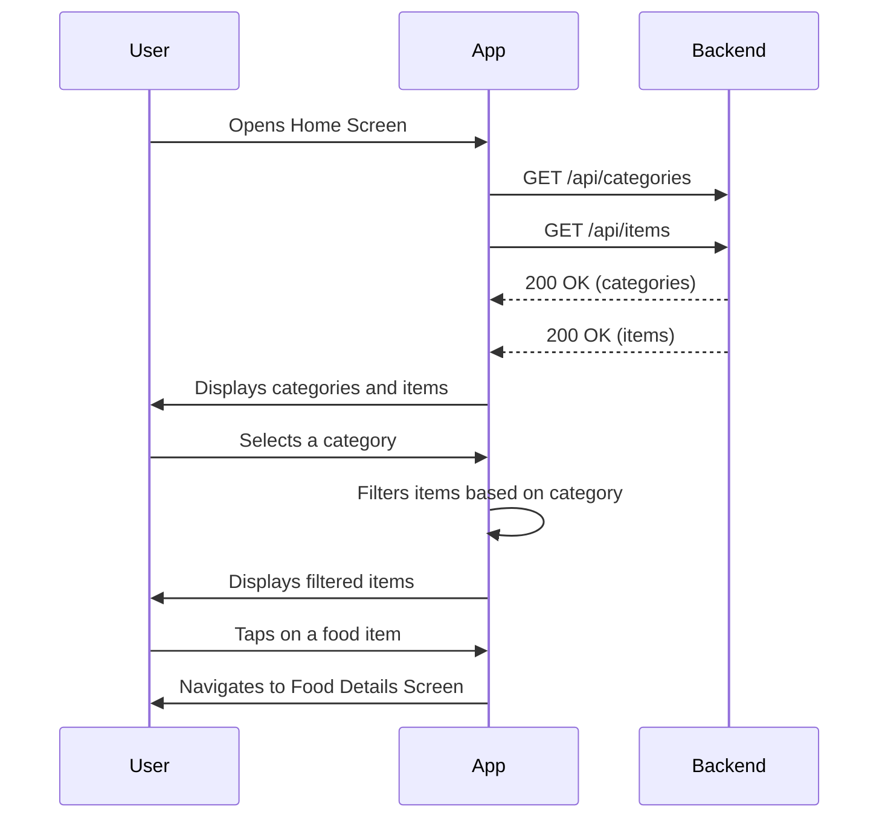
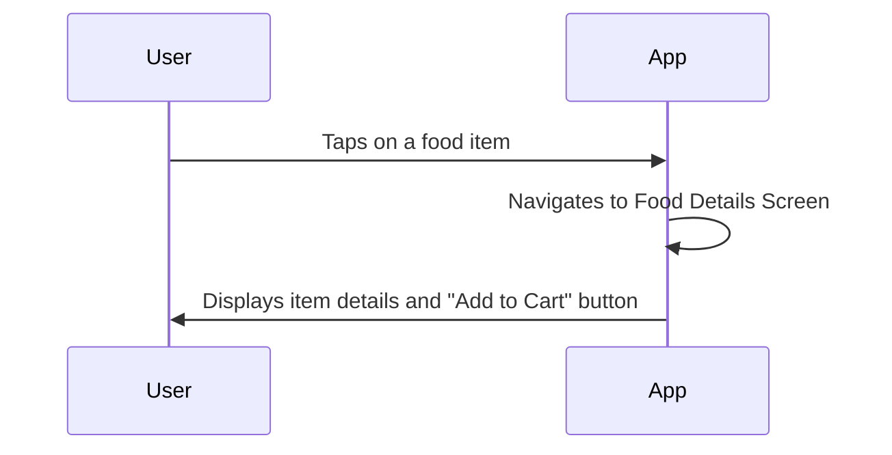

# Menu Browsing Workflow

This document describes the menu browsing workflow in the QuickBite application, which allows users to view food categories and items.

## 1. View Categories and Items

The main screen of the application displays a list of food categories and a grid of food items.

### Steps

1.  The user opens the application and lands on the home screen.
2.  The application fetches the list of categories and all food items from the backend.
3.  The user can scroll through the list of categories.
4.  The user can select a category to filter the food items.
5.  The user can scroll through the grid of food items.
6.  The user can tap on a food item to view its details.

### Visualization

## 2. View Food Item Details

When a user selects a food item, they are taken to the food item details screen.

### Steps

1.  The user is on the home screen.
2.  The user taps on a food item.
3.  The application navigates to the food item details screen, passing the selected item's data.
4.  The food item details screen displays the item's name, description, price, image, and an "Add to Cart" button.

### Visualization

