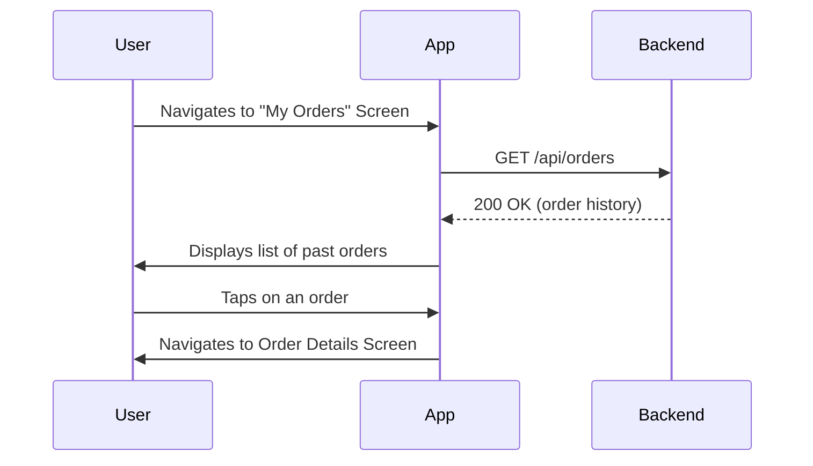
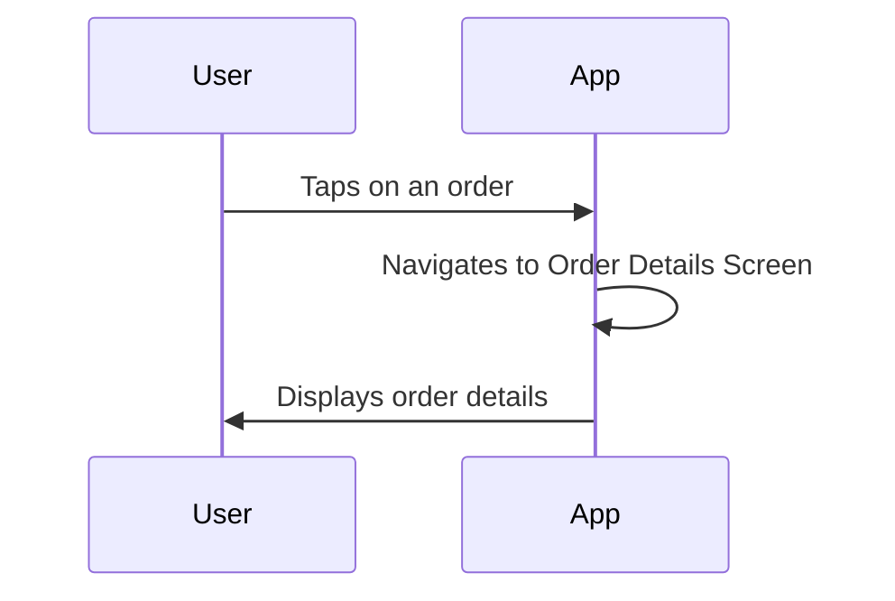

# Order Management Workflow

This document describes the order management workflow in the QuickBite application, which allows users to view their past orders.

## 1. View Order History

Users can view a list of their past orders.

### Steps

1.  The user navigates to the "My Orders" screen.
2.  The application fetches the user's order history from the backend.
3.  The application displays a list of past orders, with the most recent orders first.
4.  Each order in the list shows the order ID, date, total price, and status.
5.  The user can tap on an order to view its details.

### Visualization

## 2. View Order Details

When a user selects an order, they are taken to the order details screen.

### Steps

1.  The user is on the "My Orders" screen.
2.  The user taps on an order.
3.  The application navigates to the order details screen, passing the selected order's data.
4.  The order details screen displays the order ID, date, total price, status, delivery address, and a list of the items in the order.

### Visualization

