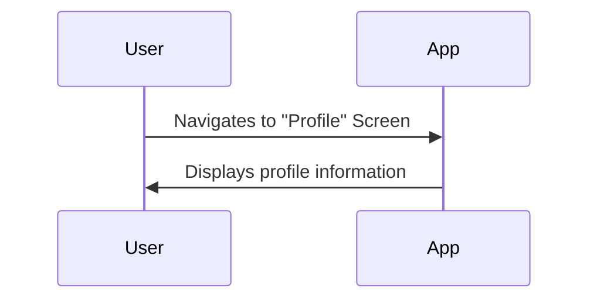
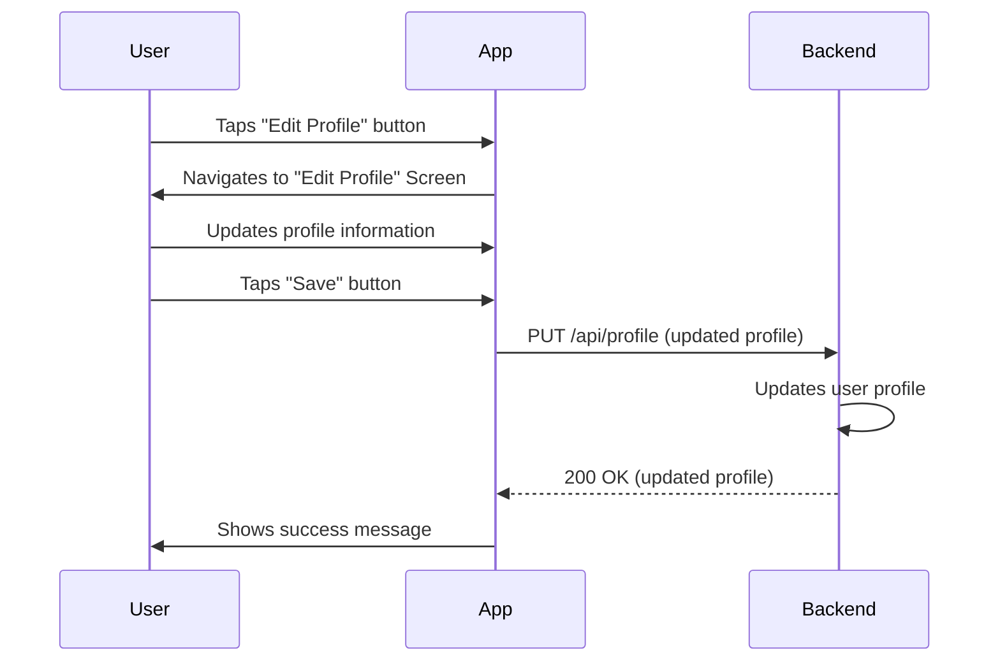

# Profile Management Workflow

This document describes the profile management workflow in the QuickBite application, which allows users to view and update their profile information.

## 1. View Profile

Users can view their profile information.

### Steps

1.  The user navigates to the "Profile" screen.
2.  The application displays the user's name, email address, and other profile information.

### Visualization

## 2. Update Profile

Users can update their profile information.

### Steps

1.  The user is on the "Profile" screen.
2.  The user taps the "Edit Profile" button.
3.  The application navigates to the "Edit Profile" screen.
4.  The user can update their name, email address, and other profile information.
5.  The user taps the "Save" button.
6.  The application sends a request to the backend to update the user's profile.
7.  The backend updates the user's profile and returns a success response.

### Visualization

