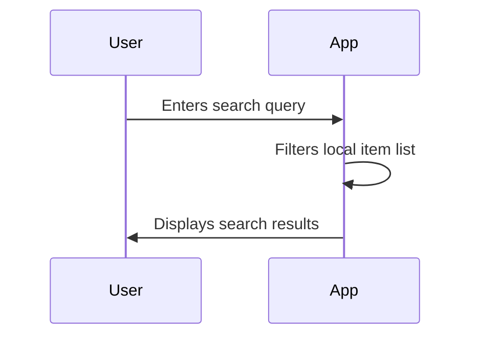
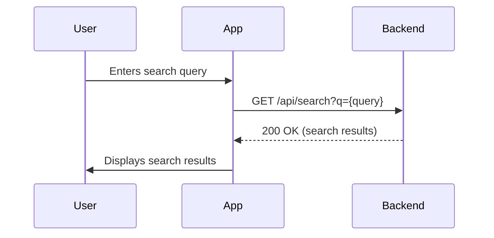

# Search Workflow

This document describes the search workflow in the QuickBite application, which allows users to search for food items.

## 1. Search for Food Items

The search functionality is available on the home screen.

### Steps

1.  The user is on the home screen.
2.  The user enters a search query in the search bar.
3.  As the user types, the application can either:
    *   **Client-side search:** Filter the currently loaded list of food items.
    *   **Server-side search:** Send a request to the backend with the search query.
4.  The application displays the search results to the user.
5.  The user can tap on a search result to view the food item details.

### Client-Side Search Visualization

### Server-Side Search Visualization

